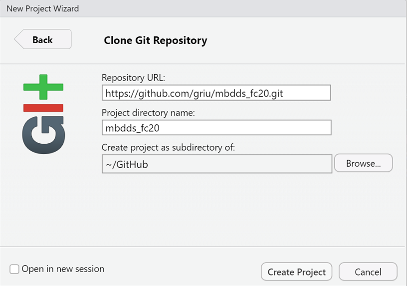

```{r setup, include=FALSE}
knitr::opts_chunk$set(echo = TRUE, fig.path="www/")
library(knitr)
library(pander)
library(kableExtra)
suppressPackageStartupMessages(library(tidyverse))
panderOptions('table.split.table', Inf)
panderOptions('decimal.mark', ",")
panderOptions('big.mark', ".")
panderOptions('missing', "")
options(knitr.kable.NA = '')
```

# Bienvenido Padawan

## Índice

<br>

- Objetivos específicos

<br>

- Actividad guiada

<br>

- Contenidos:
   1. Elementos básicos de R
   1. Gráficos con GGPLOT2
   1. Colecciones de objetos
   1. Control de flujo
   1. Gestión de datos

<br>

- Conclusiones

## Objetivos específicos

<br>

*	Realizar operaciones de lectura y escritura de datos con R.

<br>

*	Saber escoger la estructura de datos de R adecuada para cada problema.

<br>

*	Tener las bases para realizar análisis descriptivo mediante tablas y gráficos en R.

<br>

*	Desarrollar pequeñas piezas de código en R.

## Actividad guiada

:::::: {.columns}

::: {.column}

<br>

**Objetivo**

<br>

Comprender la evolución de la riqueza y la esperanza de vida de las personas a nivel de país y continente.

:::

::: {.column}

](www/gapminder.png)

:::

::::::

## 1. Elementos básicos de R

:::::: {.columns}

::: {.column}

<br>

- Entorno RStudio
   - Crear proyecto Git
   - Instalar packages des de R
   - 4 nociones de RMarkdown
   - Cheatsheet de R. Disponibles en: https://rstudio.com/resources/cheatsheets/
- Crear una función

:::

::: {.column}


:::

::::::

## 1.1. Crear proyecto Git

:::::: {.columns}

::: {.column}

<br>

- File > New Project...
- Versión Control > Git
- Repository URL:
   - https://github.com/griu/mbdds_fc20.git

:::

::: {.column}



:::

::::::

## 1.2. Instalar packages des de R

:::::: {.columns}

::: {.column}

<br>

Instala de uno en uno los siguientes paquetes desde la consola de RStudio.

<br>

En Linux: 

   - `libxml2-dev`, `libssl-dev`, `libcurl4-openssl-dev` y `libmagick++-dev`

:::

::: {.column}

<br>

`install.packages("pander")`

`install.packages("kableExtra")`

`install.packages("tidyverse")`

`install.packages("reticulate")`

`webshot::install_phantomjs()`

`install.packages("magick")`

`install.packages("ggrepel")`

`install.packages("cowplot")`

`install.packages("mosaicData")`

`install.packages("datos")`

`install.packages("flextable")`

`install.packages("gganimate")`

:::

::::::

## 1.3. R Markdown y Cheatsheets de R

:::::: {.columns}

::: {.column}

**R chunks**: \`\`\`{r, options} CODIGO R \`\`\`: echo, eval, fig.cap, warning, message. 

**R inline**: \` r CODIGO R\`

**Titulo**: \# TITULO1,  \#\# TITULO2

**Emphasis**: Negrita con `**string**` . Cursiva con `*string*`

**Link externo**: `[texto enlace](http://url)`

**Imagen**: ``

**Lista de puntos**: Al inicio de línea, usa guion `-`

**Lista numerada**: Al inicio, pon `1.`

**Código látex**:  ```$x^2$```. Salida: $x^2$

**Línea en blanco**: Una linea nueva con `<br>`

**Sangrado (Indented)**: Al incio de línea, usa símbolo `> `

:::

::: {.column}

](www/rmarkdown-2.0.png)

:::

::::::


## 2. Gráficos con GGPLOT2

<br>

Estructura basica GGPLOT2:

<br>

- `ggplot`: datos y parametros comunes
- `geom_<función>`: Tipo de gráfico
- `mapping`: Definición de estéticos con `aes`

<br>

```{r, echo=TRUE}
library(datos)
library(tidyverse)

paises07 <- as.data.frame(paises %>% filter(anio==2007))  # paises en 2007
```

## 2. Gráficos con GGPLOT2. `geom_point()`

:::::: {.columns}

::: {.column}

```{r, echo=TRUE, warning=FALSE, message=FALSE}
p07 <- ggplot(paises07
    , aes(x=pib_per_capita
    , y=esperanza_de_vida
    , color=continente
    , size=poblacion))+
  geom_point() +
  scale_x_log10() +
  labs(title="Paises en 2007")

p07
```

:::

::: {.column}

```{r, echo=FALSE, warning=FALSE, message=FALSE, fig.cap="Más paletas [geom_point()](https://ggplot2.tidyverse.org/reference/geom_point.html)"}
p07
```

:::

::::::

## 2. Gráficos con GGPLOT2. `facet_wrap()`

:::::: {.columns}

::: {.column}

```{r, echo=TRUE, warning=FALSE, message=FALSE}
p00 <- ggplot(paises
    , aes(x=pib_per_capita
    , y=esperanza_de_vida
    , color=continente
    , size=poblacion))+
  geom_point() +
  scale_x_log10() +
  facet_wrap(~anio)+
  labs(title="Paises en 2007")

p00
```

:::

::: {.column}

```{r, echo=FALSE, warning=FALSE, message=FALSE, fig.cap="Más [facet_wrap() y facet_grid()](http://zevross.com/blog/2019/04/02/easy-multi-panel-plots-in-r-using-facet_wrap-and-facet_grid-from-ggplot2/)"}
p00
```

:::

::::::

## 2. Gráficos con GGPLOT2. `geom_label()`

:::::: {.columns}

::: {.column}

```{r, echo=TRUE, warning=FALSE, message=FALSE}
p07 <- p07 + 
  geom_label(data=paises07 %>% 
    filter(pais=="China")
    , nudge_y=2
    , aes(label=pais)
    , size=4
    , color="black")

p07
```

:::

::: {.column}

```{r, echo=FALSE, warning=FALSE, message=FALSE, fig.cap="Más [geom_label()](https://www.r-graph-gallery.com/275-add-text-labels-with-ggplot2.html)"}
p07
```

:::

::::::

## 2. Gráficos con GGPLOT2. `scale_colour_brewer()`

:::::: {.columns}

::: {.column}

```{r, echo=TRUE, warning=FALSE, message=FALSE}
p07 <- p07 + 
  scale_colour_brewer(
    palette = "Dark2")

p07
```

:::

::: {.column}

```{r, echo=FALSE, warning=FALSE, message=FALSE, fig.cap="Más paletas [COLORBREWER](https://www.r-graph-gallery.com/38-rcolorbrewers-palettes.html)"}
p07
```

:::

::::::

## 2. Gráficos con GGPLOT2. `coord_cartesian()`

:::::: {.columns}

::: {.column}

```{r, echo=TRUE, warning=FALSE, message=FALSE}
p07 <- p07 + 
  coord_cartesian(
    xlim=c(300,5000)
    , ylim=c(38,45))

p07
```

:::

::: {.column}

```{r, echo=FALSE, warning=FALSE, message=FALSE, fig.cap="Más [coord_cartesian()](https://ggplot2.tidyverse.org/reference/coord_cartesian.html)"}
p07
```

:::

::::::

## 2. Gráficos con GGPLOT2. `theme_bw()`

:::::: {.columns}

::: {.column}

```{r, echo=TRUE, warning=FALSE, message=FALSE}
p07 <- p07 + 
  theme_bw()

p07
```

:::

::: {.column}

```{r, echo=FALSE, warning=FALSE, message=FALSE, fig.cap="Más en [ggtheme](https://ggplot2.tidyverse.org/reference/ggtheme.html)"}
p07
```

:::

::::::

## 2. Gráficos con GGPLOT2. `ggplotly()`

:::::: {.columns}

::: {.column}

```{r, echo=TRUE, warning=FALSE, message=FALSE}
suppressPackageStartupMessages(
  library(plotly))

ggplotly(p00)
```

:::

::: {.column}

```{r, echo=FALSE, warning=FALSE, message=FALSE, fig.cap="Más [R Plotly](https://plotly.com/r/)"}
ggplotly(p00)
```

:::

::::::

## 3. Colecciones de objetos

<br>

- Tipologías de objetos

<br>

- Filtros

<br>

- Modificación de valores

## 3. Colecciones de objetos. Vectores.

:::::: {.columns}
::: {.column}
```{r, echo=TRUE}
x<-c(1,2,3); class(x)
y<-c("m","h"); class(y)
z<-c(TRUE,FALSE); class(z)
u<-factor(c("a","b")); class(u)
levels(u)
v<-as.Date("2020-10-28"); class(v)
v + 7
length(x)
names(y)<-c("maria","jose"); y
```
:::
::: {.column}
```{r, echo=TRUE}
3 * x
x + x
x^2
paste("Genero",y,sep=":")
paste(y,collapse ="-")
substr("abcdef",2,3)
2:6
seq(2,6,2)
rep(1,3)
rep(1:3, each = 2)
as.character(u)
```
:::
::::::

## 3. Colecciones de objetos. Matrices.

:::::: {.columns}
::: {.column}
```{r, echo=TRUE}
a <- matrix(1:6, nrow = 2)
dim(a)
c(nrow(a),ncol(a))
colnames(a) <- paste0("V",1:ncol(a))
rownames(a) <- LETTERS[1:(nrow(a))]
a
```
:::
::: {.column}
```{r, echo=TRUE}
t(a) # traspuesta
t(a) %*% a # mult. matricial
a*a # producto de elementos
```
:::
::::::

## 3. Colecciones de objetos. Listas y Data frames.

:::::: {.columns}
::: {.column}
```{r, echo=TRUE}
l1 <- list(v1=c(1,4,5),v2="abcd")
length(l1)
names(l1)
l1["v2"]
l1[[1]]
```
:::
::: {.column}
```{r, echo=TRUE}
df<-data.frame(u1=c(1,8),u2=c(2,3),u3=c("m","h"))
dim(df)
colnames(l1)
df$u1
df[["u2"]]
df[,3]
df[2,3]
```
:::
::::::

## 3. Colecciones de objetos. Filtros y modificación valores.

:::::: {.columns}
::: {.column}
```{r, echo=TRUE}
df<-data.frame(u1=c(1,8),u2=c(2,3),u3=c("m","h"))
df[1,]
df[,-c(2,3)]
df[c(TRUE,FALSE),]
df[df$u3=="h",]
df[df$u1 %in% c(8,9),]
```
:::
::: {.column}
```{r, echo=TRUE}
df[1,1] <- NA
df[,2] <- df[,2] * 3
df[,3] <- "m"
df
df[,1] + 7
df[is.na(df)] <- 0
which(c(6,-2,NA,9) > 0)
```
:::
::::::

## 4. Control de flujo

:::::: {.columns}
::: {.column}
```{r, echo=TRUE}
# Funciones
sqrt_2 <- function(x) {round(sqrt(x[which(x>0)]),3)}
x1 <- c(5,-1,9,NA,6)
x1
sqrt_2(x1)
# Condicionales
if(1>6) {print("a")} else if (2<7) {print("b")} else {print("c")} 
ifelse(x1>=0, x1, NA)
```
:::
::: {.column}
```{r, echo=TRUE}
# Bucles
for(y in x1) print(y^2)
```
:::
::::::


## 5. Gestión de datos

<br>

- Lectura, escritura de datos

<br>

- Cruces de tablas

<br>

- Resúmenes de agregados

<br>

- Agregados por subgrupos

<br>

- Familia apply: 

<br>

- Tydiverse

<br>

- Lubridate: gestión de fechas y horarios

## 5. Gestión de datos. Lectura, escritura de datos.

```{r, echo=TRUE}
mtcars <- read.table("www/mtcars.csv", dec=".",sep=",", header=TRUE)
mtcars <- read.csv("www/mtcars.csv")
fwf_sample <- read.fwf("www/fwf-sample.txt", widths=c(20,10,12), col.names=c("name", "state", "ssn"))
save(mtcars,fwf_sample,file="www/objectes.RData")
rm(mtcars,fwf_sample)  # borramos
load(file="www/objectes.RData")
ls()
fwf_sample
```

## 5. Gestión de datos. Cruces de tablas.

:::::: {.columns}
::: {.column}
```{r, echo=TRUE}
a <- head(mtcars[,c("wt","qsec")],3)
sort(a$wt)
b<-a[order(a$wt),]
b
cbind(c(5,1,8),c(3,6,1))
rbind(c(5,1,8),c(3,6,1))
```
:::
::: {.column}
```{r, echo=TRUE}
a1 <- data.frame(ID = c(1,2,3), X1 = c(1,1,2), X2 = c("b","a","a"))
a2 <- data.frame(ID = c(2,3,3,4), X1 = c(1,1,2,2), X3 = c(FALSE, TRUE, FALSE, FALSE))
a_right <- merge(a1, a2, all.y = TRUE, by.x="ID", by.y="ID")
a_right
```
:::
::::::

## 5. Gestión de datos. Resúmenes de agregados

:::::: {.columns}
::: {.column}
```{r, echo=TRUE}
summary(mtcars[,c(1,2)])
table(mtcars$cyl)
table(mtcars$vs,mtcars$cyl)
```
:::
::: {.column}
```{r, echo=TRUE}
min(mtcars$mpg)
quantile(mtcars$mpg, c(0,0.25,0.5,0.75,1))
median(mtcars$mpg)
mean(mtcars$mpg)
max(mtcars$mpg)
```
:::
::::::

## 5. Gestión de datos. Agregados por subgrupos

:::::: {.columns}
::: {.column}
```{r, echo=TRUE}
aggregate(mtcars[,c(1,2)],list(vs=mtcars$vs),mean)
tapply(mtcars$mpg,mtcars$vs,mean)
sapply(mtcars[,1:3],class)  # tb lapply
apply(mtcars[1:6,1:3],1,max) # filas
apply(mtcars[,1:3],2,max) # columnas
```
:::
::: {.column}
```{r, echo=TRUE}
a <- mtcars %>% select(mpg,cyl,vs) %>% arrange(cyl) %>% filter(cyl==6)

a %>% group_by(vs) %>% mutate(mpg_m=mean(mpg)) %>% ungroup() %>% head(3)
a %>% group_by(vs) %>% summarise(N=n(),mpg_m=mean(mpg))
```
:::
::::::

## 5. Gestión de datos. Lubridate.

:::::: {.columns}
::: {.column}
```{r, echo=TRUE, message=FALSE, warning=FALSE}
library(lubridate)
ymd("2017-01-31") # Días des de texto
ymd_hms("2017-01-31 20:11:59")
make_datetime(2020, 08, 24, 15, 36)
as_datetime(today()) # Conversión
Sys.setlocale(locale="es_ES.UTF-8")
fechahora <- ymd_hms("2019-03-28 15:11:23")
year(fechahora)
month(fechahora, label = TRUE)
wday(fechahora, label = TRUE, abbr = FALSE) 
```
:::
::: {.column}
```{r, echo=TRUE}
year(fechahora) <- 2020
floor_date(fechahora, "month")
edad_h <- today() - ymd(19760623)
as.duration(edad_h)
fechahora <- ymd_hms("2020-03-28 15:11:23", tz = "Europe/Madrid")
fechahora + dhours(24)
fechahora + hours(24)
```
:::
::::::

## Conclusiones

<br>

-	R cubre todo el espectro de trabajo con datos.

<br>

-	Es un lenguaje rápido de implementar y de ejecución óptima.

<br>

-	Aporta una gran facilidad para la visualización de datos.

# Que la fuerza te acompañe
