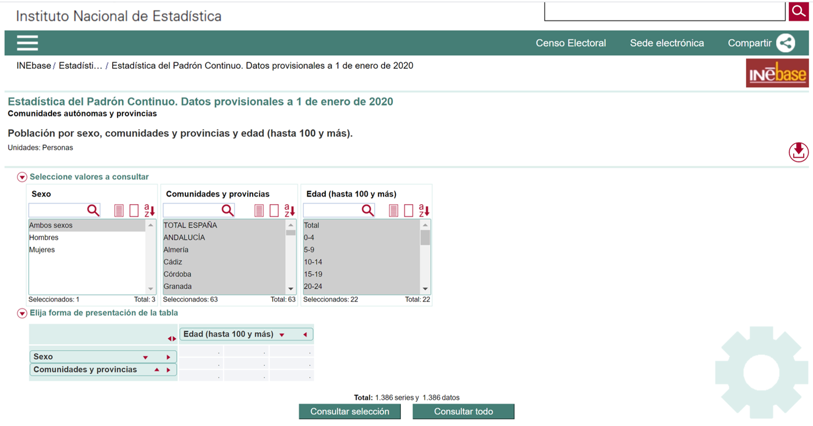
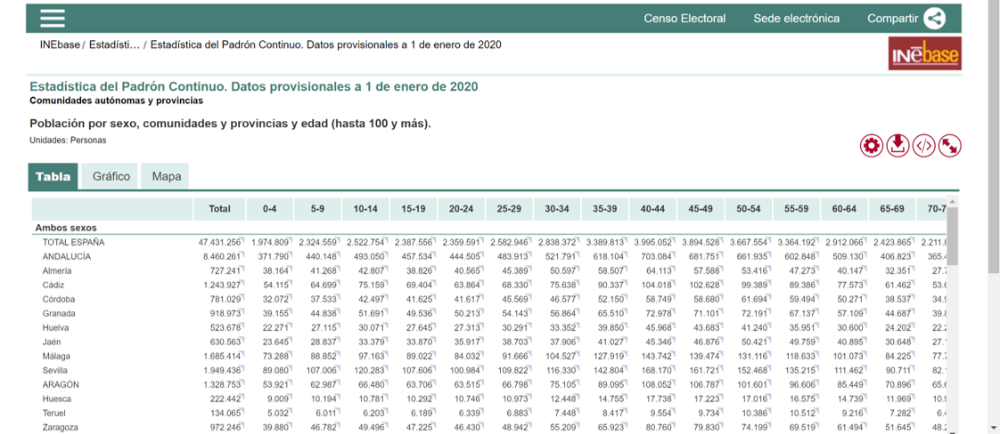
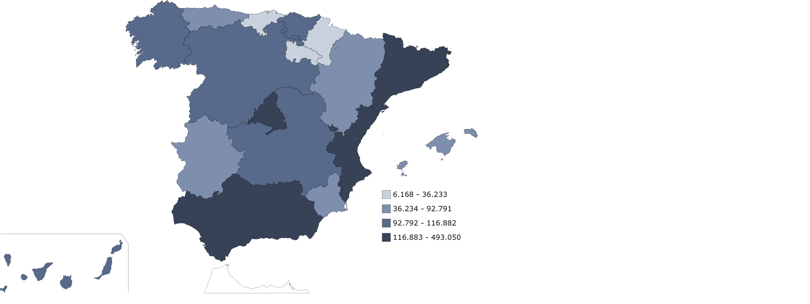

```{r include=FALSE}
knitr::opts_chunk$set(echo = TRUE, fig.path="www/")
library(knitr)
library(pander)
library(kableExtra)
suppressPackageStartupMessages(library(tidyverse))
panderOptions('table.split.table', Inf)
panderOptions('decimal.mark', ",")
panderOptions('big.mark', ".")
panderOptions('missing', "")
options(knitr.kable.NA = '')
library(reticulate)
#use_condaenv("mbdds_rpy20")
```

## 1.3. Fuentes de datos externas oficiales (INE, EUROSTAT...)

<br>

Las fuentes de datos oficiales son un gran recurso para enriquecer la calidad de los datos utilizados dentro de nuestro análisis.

Supone una fuente de datos fiables, exhaustivos, tanto en temática como en ámbito geográfico, y habitualmente se pueden actualizar de forma recurrente.

Este tema se centra en la exploración de 3 fuentes de datos de 3 ámbitos:

<br>

- **Nacional**: Instituto Nacional de Estadística ([INE](https://www.ine.es/)).
- **Europeo**: Oficina estadística de la Comisión Europea ([EUROSTAT](https://ec.europa.eu/eurostat)).
- **Global**: Datos abiertos del Banco Mundial ([WORLD DATA BANK](https://data.worldbank.org/)).

<br>

##### Actividad guiada 1.1.

<br>

Con el objetivo de obtener datos relacionados con nuestra saga cinematográfica favorita, Star Wars, se pide buscar estadísticas en 2 sentidos:

<br>

- Analizar el volumen de población en cada región, por tramos de edad, con el objetivo de invertir más o menos presupuesto de publicidad.
- Conocer el volumen de facturación de la industria cinematográfica por año.

<br>

\<piensa un minuto\>La Clasificación Nacional de Actividades Económicas ([CNAE](https://www.ine.es/uc/IqQUWcoZ)) es utilizada por las oficinas estadísticas y está uniformizada por toda la Unión Europea. Permite identificar 630 actividades económicas distintas agrupadas de forma jerárquica en 2, 3 y 4 dígitos. Las "Actividades cinematográficas, de vídeo y de programas de televisión" tiene el epígrafe **"591"**. Puedes ver el listado completo en el siguiente [enlace](https://www.ine.es/daco/daco42/clasificaciones/cnae09/estructura_cnae2009.xls)\ del INE</piensa un minuto\>

<br>

### 1.3.1. Instituto Nacional de Estadística (INE)

<br>

El INE es un organismo del estado Español con un papel destacado en la actividad estadística pública. Realiza los censos demográficos, económicos, las cuentas nacionales, estadísticas demográficas y sociales, indicadores económicos y sociales, coordinación y mantenimiento de los directorios de empresas, formación del Censo Electoral,...

Además, regula las relaciones con las oficinas de estadística territoriales y con la Oficina Estadística de la Unión Europea (EUROSTAT).

El INE ha creado el espacio **Datos abiertos**, accesible tanto a través de la web del INE: [www.ine.es/datosabiertos](www.ine.es/datosabiertos), como a través del portal [datos.gob.es](http://datos.gob.es/). Los conjuntos de datos y aplicaciones más relevantes son:

<br>

- Información estadística elaborada por el INE y publicada en [INEbase](https://www.ine.es/dyngs/INEbase/listaoperaciones.htm): Permite acceder a los resultados agregados de las estadísticas por temas.
- [Microdatos](https://www.ine.es/prodyser/microdatos.htm) anonimizados de encuestas: Permite acceder a los datos obtenidos de algunas encuestas a nivel de registros (microdatos) de forma anónima. En general consiste en ficheros de texto, con columnas en formato de ancho fijo. Su lectura requiere el uso de un diccionario, que especifica el significado de cada variable.
- [Callejero](https://www.ine.es/prodyser/callejero/) de censo electoral: Contiene el catálogo de calles, números de calle y códigos postales en España.
- [API JSON](https://www.ine.es/dyngs/DataLab/manual.html?cid=45): Especifica una API de consulta de los datos de INEbase y Tempus3.

<br>

#### INEBASE

<br>

Los datos de [INEbase](https://www.ine.es/dyngs/INEbase/listaoperaciones.htm) se pueden consumir directamente desde la web. El procedimiento es simple. Se navega por el árbol temático para seleccionar aquellos datos que puedan ser de nuestro interés.

Para nuestra actividad vamos a centrarnos en los apartados de "Demografía y población" y "Economía".

<br>

##### Demografía y población

<br>

Tenemos 2 apartados de nuestro interés:

<br>

- Padrón. Población por municipios:
   - Estadística del Padrón continuo: (01/01/2020)
- Cifras de población y Censos demográficos
   - Cifras de población: (Datos provisionales 01/01/2020)

<br>

El **Padrón Municipal**, es un **registro** donde constan los vecinos del municipio. Su gestión está al cargo de los respectivos ayuntamientos. Se publican cada 1 de Enero e informan los totales de población hasta nivel inframunicipal de sección censal.

\<sabías que\>Sección censal es la unidad mínima de información estadística. Se utiliza parar organizar los procesos electorales. Agrupan entre 1.500 y 2.000 habitantes.\</sabías que\>

<br>

A su vez, las **Cifras de Población** son una operación estadística. Utiliza distintas encuestas para elaborar las cifras oficiales de población. Se publican los datos de forma semestral a nivel de provincia.

Para nuestra actividad, nos centramos en la [Estadística del Padrón continuo](https://www.ine.es/dyngs/INEbase/es/operacion.htm?c=Estadistica_C&cid=1254736177012&menu=ultiDatos&idp=1254734710990) > Resultados > Comunidades autónomas y provincias > [2.3 Población por edad (grupos quinquenales) y sexo](https://www.ine.es/jaxi/Tabla.htm?path=/t20/e245/p04/provi/l0/&file=0ccaa003.px&L=0)

<br>

{width=750px}

\<imagen1\>Imagen: Padrón continuo (Fuente: [INE](https://www.ine.es) ). (www/01_ine.png){width=750px}


<br>

Se selecciona "Ambos sexos", todas las Comunidades y Edades.

<br>

{width=750px}

\<imagen1\>Imagen: Población por Comunidad y Edad (Fuente: [INE](https://www.ine.es) ). (www/02_ine.png){width=750px}

<br>

Posteriormente el formulario permite descargar los datos en distintos formatos (csv, Excel...), así como generar gráficos y mapas:

<br>

{width=750px}

\<imagen1\>Imagen: Población de 10-14 años (Fuente: [INE](https://www.ine.es) ). (www/03_ine.png){width=750px}

<br>

En el siguiente punto se muestra como descargar los datos directamente desde Python mediante la API JSON del INE. Con este objetivo se obtiene la url de los datos:

<br>

- Botón de flecha de Descarga
- Json
- Se abre una ventana y copiamos la url: `https://servicios.ine.es/wstempus/js/es/DATOS_TABLA//t20/e245/p04/provi/l0/0ccaa003.px?tip=AMtv=sexo:ambossexos`

<br>

#### API JSON

<br>

Para practicar con la API de INE, [abre 1.3. Datos Oficiales en Colab](https://colab.research.google.com/github/griu/mbdds_fc20/blob/master/datos_digitales/modulo3_tema1_dd_02_oficiales.ipynb).

<br>

### 1.3.2. Oficina Estadística de la Comisión Europea (EUROSTAT)

<br>

La Oficina Estadística de la Unión Europea (EUROSTAT), tiene como misión proveer estadísticas y datos de alta calidad sobre Europa.

Para cumplir con este objetivo, participa con el rol de coordinador dentro del European Statistical System (ESS), conjuntamente con el resto de oficinas estadísticas oficiales de los estados del Área Económica Europea y Suiza. Además, se coordina con otros organismos superiores como el World Data Bank.  

El EUROSTAT trabaja para que exista un alto grado de armonización de los distintos estudios estadísticos realizados por los estados de Europa. Gracias a esta armonización existe un gran número de indicadores socioeconómicos y demográficos comparables entre los estados. 

<br>

#### Bases de datos

<br>

Los datos de EUROSTAT, de forma temática en [Estadísticas por temas](https://ec.europa.eu/eurostat/data/browse-statistics-by-theme): Estadística regionales, Economía y finanzas...

<br>

##### Tablas resumen

<br>

Estas estadísticas, al igual que en el INE, se pueden consultar desde la web en formato de tablas agregadas y posteriormente descargar los datos en distintos formatos.

<br>

##### Ficheros de microdatos

<br>

Otro apartado relevante, son los [ficheros de microdatos](https://ec.europa.eu/eurostat/web/microdata/overview). Estos datos permiten acceder a datos individuales sobre las respuestas a las encuestas estadísticas (raw data). Algunos ejemplos de interés son: [Encuesta de ingresos y condiciones de vida](https://ec.europa.eu/eurostat/web/microdata/statistics-on-income-and-living-conditions) o  [Encuesta de la fuerza laboral](https://ec.europa.eu/eurostat/web/microdata/labour-force-survey).

<br>

##### API REST

<br>

Para practicar con la API de EUROSTAT, [abre 1.3. Datos Oficiales en Colab](https://colab.research.google.com/github/griu/mbdds_fc20/blob/master/datos_digitales/modulo3_tema1_dd_02_oficiales.ipynb).

<br>

### 1.3.3. Datos abiertos del Banco Mundial (WORLD BANK DATA)

<br>

El [World Bank Data](https://data.worldbank.org/), en los últimos años, de la mano del auge del [Open Data](https://en.wikipedia.org/wiki/Open_data), se ha convertido en una herramienta muy potente para comparar las estadísticas de los países y analizar su evolución.

<br>

#### Estructura WBD

<br>

La estructura es muy similar al resto de oficinas estadísticas oficiales:

- Un [navegador temático](https://databank.worldbank.org/home.aspx): Permite visualizar datos agregados y descargar datos en distintos formatos.
- Acceso a [microdatos](https://microdata.worldbank.org/index.php/home): Para acceder a datos individualizados de encuesta.
- Acceso por [API](https://datahelpdesk.worldbank.org/knowledgebase/topics/125589) para desarrolladores.

<br>

#### Librería world_bank_data

<br>

Para practicar con la Librería world_bank_data, [abre 1.3. Datos Oficiales en Colab](https://colab.research.google.com/github/griu/mbdds_fc20/blob/master/datos_digitales/modulo3_tema1_dd_02_oficiales.ipynb).

<br>

## 1.4. Google Analytics

<br>

Para acceder al módulo de Google Analytics puedes clicar el siguiente enlace de Colab: [Abre 1.4. Google Analytics](https://colab.research.google.com/github/griu/mbdds_fc20/blob/master/datos_digitales/modulo3_tema1_dd_03_ganalytics.ipynb).

<br>

## 1.5. Social Analytics

<br>

Para acceder al módulo de Social Analytics (Twitter, Facebook, Hootsuite) puedes clicar el siguiente enlace de Colab: [Abre 1.4. Social Analytics](https://colab.research.google.com/github/griu/mbdds_fc20/blob/master/datos_digitales/modulo3_tema1_dd_04_sanalytics.ipynb).

<br>

## 1.6. Web scraping

<br>

Para acceder al módulo de Web Scraping puedes clicar el siguiente enlace de Colab: [Abre 1.4. Web Scraping](https://colab.research.google.com/github/griu/mbdds_fc20/blob/master/datos_digitales/modulo3_tema1_dd_05_webscraping.ipynb).

<br>

