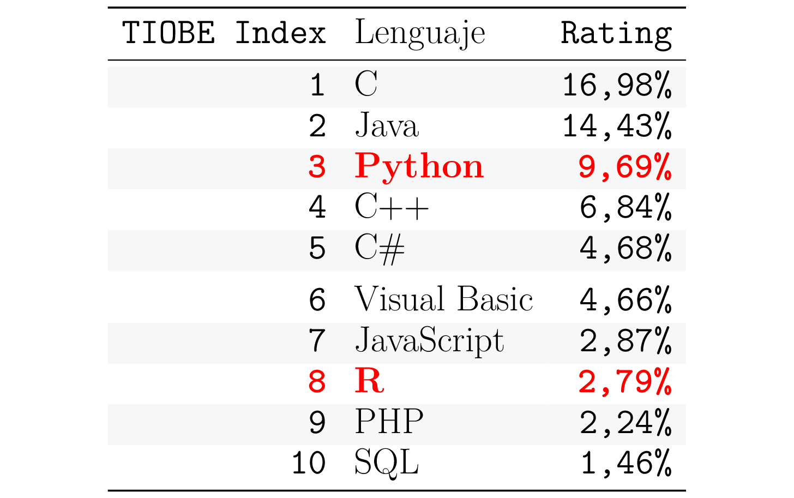
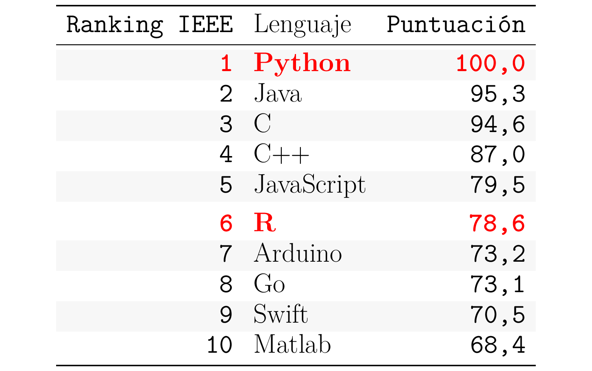
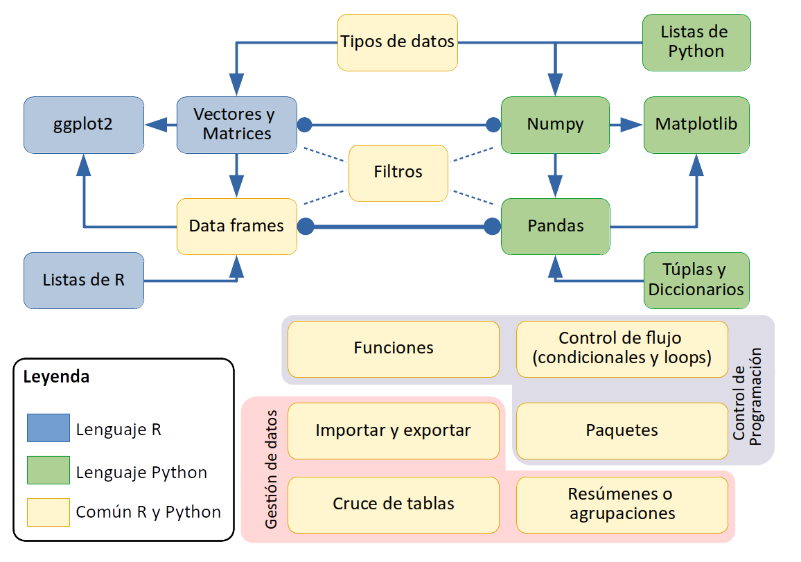

```{r setup, include=FALSE}
knitr::opts_chunk$set(echo = TRUE)
library(knitr)
library(pander)
library(kableExtra)
suppressPackageStartupMessages(library(tidyverse))
panderOptions('table.split.table', Inf)
panderOptions('decimal.mark', ",")
panderOptions('big.mark', ".")
panderOptions('missing', "")
options(knitr.kable.NA = '')
```

```{=openxml}
<w:p>
  <w:r>
    <w:br w:type="page"/>
  </w:r>
</w:p>
```

# OBJETIVOS

- Realizar operaciones de lectura y escritura de datos.
- Saber escoger la estructura de datos adecuada para cada problema.
- Tener las bases para realizar análisis descriptivo mediante tablas y gráficos en R y Python.
- Desarrollar pequeñas piezas de código en R y Python.

# INTRODUCCIÓN


#### {width=30px}  [R](https://www.R-project.org/)

Es un lenguaje y entorno utilizado para la computación estadística.

> \<sabías que\>Es un programa de código abierto, desarrollado por Robert Gentleman y Ross Ihaka del Departamento de Estadística de la Universidad de Auckland en 1993 como un "clon" del lenguaje S desarrollado por los Laboratories de AT&T en Nueva Jersey en 1970.\</sabías que\> 

#### {width=30px}  [Python](https://www.python.org/)

Es un lenguaje interpretado, de alto nivel y de propósito general

> \<sabías que\>Es un programa de código abierto, creado en 1989 por Guido van Rossum en el Centro de Matemáticas e Informática (CWI, Centrum Wiskunde & Informatica), en los Países Bajos.\</sabías que\> 

Con el objetivo de valorar su relevancia, a continuación se analiza su posición en dos de los rankings de referencia en lenguajes de programación: 

- **TIOBE ÍNDICE**: El ranking [TIOBE Índece de Agosto 2020](www.tiobe.com) ordena por popularidad los lenguajes de programación mediante las búsquedas realizadas en los principales motores: Google, Baidu, Yahoo, Wikipedia, etc. 
- **Ranking IEEE**: El ranking ["*Top programming languages 2020*" de la IEEE](https://spectrum.ieee.org/at-work/tech-careers/top-programming-language-2020) se construye combinando 11 métricas de 8 fuentes distintas: *CareerBuilder*, *GitHub*, *Google*, *Hacker News*, *IEEE*, *Reddit*, *Stack Overflow* y *Twitter*.

####### {width=285px} {width=285px}
####### Fuente (izquierda): Elaborada a partir de [TIOBE](http://www.tiobe.com).
######## Fuente (derecha): Elaborada a partir de [IEEE](https://spectrum.ieee.org).

En el *TIOBE Índice*, Python se encuentra en tercera posición y R en octava. En el ranking de la *IEEE*, ambos aparecen de nuevo dentro del top 10, Python como el lenguaje ganador y R ocupando la sexta posición, a pesar de ser un lenguaje de nicho (análisis de datos). 

Viendo ambos rankings, se puede deducir que tanto R como Python son líderes en la categoría de lenguajes con capacidades analíticas avanzadas. Los contenidos de este tema permiten comprender los motivos de esta popularidad y profundizar en el análisis de datos mediante R y Python.

## MINDMAP

Para poder tener una visión global del tema se presenta el siguiente Esquema global:

####### {width=500}
######## Fuente: Elaboración propia.

Los **tipos de datos** pueden ser numéricos, de texto, fechas y factores (en el caso de R). Para poder agrupar estos datos básicos en colecciones o listas, se presentan las siguientes estructuras:

- **Listas de Python**: colección ordenada y mutable. Ejemplo: `['elefante','león','ratón']`.
- **Tuplas de Python**: colección ordenada e inmutable. Ejemplo: `(0,1,2,3,4,5,6,7,8,9)`.
- **Diccionarios de Python**: colección indexada por clave y mutable. Ejemplo: `{'nombre': 'Juan', 'Edad': 25, 'dirección': {'calle': 'París', 'número': 33}}`.
- **Listas de R**: Combina listas de Python (ordenadas y mutables) y diccionarios (indexados).

> \<piensa un minuto\>Python dispone de muchísimas formas para agrupar los datos. Esto le da mucha agilidad para procesar **datos no estructurados**: datos web, datos de texto, imágenes...\</ piensa un minuto\>  

Los vectores y matrices existen de forma nativa en R. En el caso de  Python se implementaron en la librería [numpy](https://numpy.org/) en 2002:

- **Vectores**: Lista de elementos homogénea (de un mismo tipo de datos).
- **Matrices**: Vectores con estructura de 2 dimensiones (filas y columnas) o más.

> \<sabías que\>R está basado en [LISP](https://en.wikipedia.org/wiki/Lisp_(programming_language)), un lenguaje de programación orientado a listas. Originalmente especificado en 1958, LISP fue clave para el desarrollo de la inteligencia artificial\</sabías que\>

Los **Data Frames** también existen de forma nativa en R. Python los implementó en 2009 en la librería [pandas](https://pandas.pydata.org/). Se estructuran como una lista de vectores columna de una misma longitud, es decir, similar a una matriz de 2 dimensiones, donde cada columna puede tener un tipo de datos distinto (numérico, carácter…).

> \<importante\>Los Data frames se organizan en **columnas** de vectores, en cambio, las bases de datos tradicionales se organizan en **filas**. Los Dataframes son más rápidos en tareas de análisis frente a las Bases con mejor desempeño en gestión de registros o filas.\</importante\>

Los **filtros** permiten seleccionar filas y columnas de Matrices y Data Frames.

Respecto a los gráficos en R, se introduce [ggplot2](https://ggplot2.tidyverse.org/) que se utilizará dentro del máster en los módulos 3, 4 y 5. En Python se introduce [matplotlib](https://matplotlib.org/) que se utilizará en el módulo 2.

> \<sabías que\>**ggplot2** está desarrollada por *Hadley Wickham* en 2005. Por su lado, **matplotlib* desarrollada por *John Hunter* en 2003, basada en el sistema de gráficos del software [MATLAB](https://www.mathworks.com/products/matlab.html).\<sabías que\> 

Las capacidades de control de la programación consisten en:

- **Funciones**: Definidas a partir de un nombre y unos parámetros de entrada y salida.
- Control de flujo mediante **condicionales** (`if`) y **bucles o loops** (`for`).
- **Librerías de funciones** o paquetes: Conjunto de funciones con un objetivo común.

La gestión de datos consiste en:

- **Importación y exportaciones** de formatos propios, texto u otros: bases de datos, *MS Excel*...
- **Cruce entre tablas** mediante campos clave comunes. Por ejemplo: `inner join`, `left join`...
- Operaciones con *Data Frames* de **agrupación** a partir de una o varias variables categóricas.
- Construcción de **tablas resumen** de datos como por ejemplo: conteos, medias, etc.

## RECURSOS DISPONIBLES

Las actividades de evaluación del tema 1.4 se realizan mediante:

- **Micro-actividades individuales**: Una para cada lenguaje. Debe usarse algún control de versiones.
- **Tests** de la parte teórica: Asentamiento de conceptos teóricos. Hay que superar el 50% del test que supondrá como máximo el 30% de la nota final del módulo.

Se recomienda aprovechar todos los recursos disponibles online:

- Materiales teóricos en PDF.
- Vídeos didácticos: uno para cada lenguaje.
- Notebooks de acompañamiento en [Github](https://github.com/griu/mbdds_rpy.git):
  - [Rmarkdown](https://rmarkdown.rstudio.com/) en el caso de R.
  - [Colab](https://colab.research.google.com/) en el caso de Python.

# EJECUCIÓN INTERACTIVA

## PROGRAMACIÓN EN R

Puedes ejecutar el temario de R de forma interactiva accediendo con RStudio a tu directorio git local, o bien, consultar los códigos fuente en Github.

- [Introducción](https://github.com/griu/mbdds_fc20/blob/master/R/modulo1_tema4_R.Rmd).
- [Elementos básicos de R](https://github.com/griu/mbdds_fc20/blob/master/R/modulo1_tema4_R_01_elem_bas.Rmd).
- [Gráficos con ggplot2](https://github.com/griu/mbdds_fc20/blob/master/R/modulo1_tema4_R_02_ggplot2.Rmd).
- [Colecciones de objetos](https://github.com/griu/mbdds_fc20/blob/master/R/modulo1_tema4_R_03_colec_obj.Rmd).
- [Control de flujo](https://github.com/griu/mbdds_fc20/blob/master/R/modulo1_tema4_R_04_contr_flujo.Rmd).
- [Gestión de datos](https://github.com/griu/mbdds_fc20/blob/master/R/modulo1_tema4_R_05_gest_dat.Rmd).

# PROGRAMACIÓN EN PYTHON

El temario de Python se pueden ejecutar desde Colab, accediendo directamente desdel enlace que encontrarás en cada notebooks. Aunque no es imprescindible, también puedes usar el entorno de Jupyter local tal cual se explica en la guía del README del [anexo](#anexo-readme).

Puedes ejecutar de forma interactiva los materiales de Python en Colab en el enlace que encontrás en la cabecera de los siguientes notebooks.

   - [Introducción](https://github.com/griu/mbdds_fc20/blob/master/Python/modulo1_tema4_Py.ipynb).
   - [Elementos básicos de Python](https://github.com/griu/mbdds_fc20/blob/master/Python/modulo1_tema4_Py_01_elem_bas.ipynb).
   - [Gráficos con matplotlib](https://github.com/griu/mbdds_fc20/blob/master/Python/modulo1_tema4_Py_02_ggplot2.ipynb).
   - [Colecciones de objetos](https://github.com/griu/mbdds_fc20/blob/master/Python/modulo1_tema4_Py_03_colec_obj.ipynb).
   - [Control de flujo](https://github.com/griu/mbdds_fc20/blob/master/Python/modulo1_tema4_Py_04_contr_flujo.ipynb).
   - [Gestión de datos](https://github.com/griu/mbdds_fc20/blob/master/Python/modulo1_tema4_Py_05_gest_dat.ipynb).

# IDEAS CLAVE

- R y Python cubren todo el espectro de trabajo con datos.
- Son lenguajes rápidos de implementar y de ejecución óptima.
- Aportan una gran facilidad para la visualización de datos.

# BIBLIOGRAFÍA

- Y. Xie, J. J. Allaire, G. Grolemund. R Markdown: The Definitive Guide. Chapman & Hall/CRC; 2020. Disponible en: https://bookdown.org/yihui/rmarkdown/

Guía para elaborar con Rmarkdown, documentos que combinan texto, análisis en R o Python con los resultados (tablas o gráficos).

- W. Chang. R Graphics Cookbook,  O’Reilly Media, Inc. 2nd ed.; 2020. Disponible en: https://r-graphics.org/

- W. McKinney. Python for Data Anlysis. O’Reilly Media, Inc. 2nd ed.; 2017

Profundizar en el uso de Pandas, NumPy y Matplotlib para el análisis y preparación de datos.

- G. Grolemund, H. Wickham. R for Data Science.  O’Reilly; 2017. Disponible en: https://es.r4ds.hadley.nz/ (Castellano)

Aprender a cargar datos en R, escoger la estructura de datos óptima, transformarlos, visualizarlos y modelarlos.

- J. VanderPlas. Python Data Science Handbook. O’Reilly Media, Inc.; 2016. Disponible en: http://faculty.marshall.usc.edu/gareth-james/ISL/

Profundizar en el uso de Pandas, Numpy y Machine Learning.

- G. Grolemund. Hands-On Programming with R. O’Reilly; 2014. Disponible en:
https://rstudio-education.github.io/hopr/

Aprender a programar en R básico mediante ejemplos prácticos.

- C. R. Severance. Python para todos. Elliott Hauser, Sue Blumenberg; 2009. Disponible en: https://www.py4e.com/book.php

Cubre todo lo básico de Python más la interacción con bases de datos, visualización y modelado.

- R. Kabacoff. Data Visualization with R. 2018. Disponible en: https://rkabacoff.github.io/datavis/Models.html#SaratogaHouses

Visualización de datos con R.


# RECURSOS EN INTERNET

- [Cheatsheet de R](https://rstudio.com/resources/cheatsheets/)
- [Cheatsheet de Python](https://www.pythoncheatsheet.org/)

# ANEXO: README 

```{r, child='README.md'}
```
