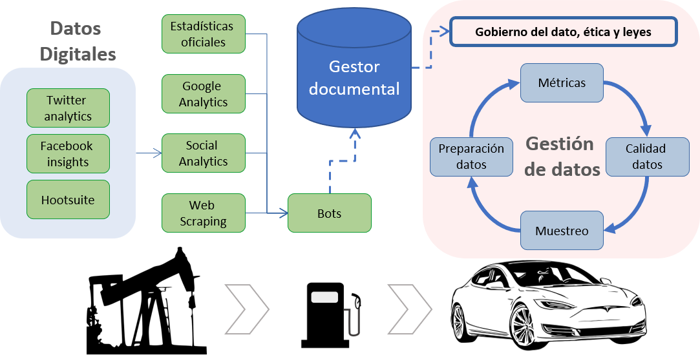

```{r setup, include=FALSE}
knitr::opts_chunk$set(echo = TRUE)
library(knitr)
library(pander)
library(kableExtra)
suppressPackageStartupMessages(library(tidyverse))
panderOptions('table.split.table', Inf)
panderOptions('decimal.mark', ",")
panderOptions('big.mark', ".")
panderOptions('missing', "")
options(knitr.kable.NA = '')
```

```{=openxml}
<w:p>
  <w:r>
    <w:br w:type="page"/>
  </w:r>
</w:p>
```

# Objetivos

<br>

- Conocer las fuentes principales de datos digitales.
- Obtener datos digitales mediante herramientas analíticas.
- Conocer los principios básicos del gobierno del dato, ética y leyes.
- Preparar los datos, medir la información que aportan y mejorar su calidad.
- Aplicar técnicas de muestreo para el posterior modelado de los datos.

<br>

# Introducción

<br>

Los datos digitales son una fuente de información muy valiosa. Es interesante esta cita realizada por Joris Toonders en la revista Wired en 2014:

<br>

> \<cita\>Los datos son el nuevo petróleo de la economía digital. -- Yonego, Joris Toonders (23 de julio de 2014). [Data Is the New Oil of the Digital Economy](https://www.wired.com/insights/2014/07/data-new-oil-digital-economy/). Wired \</cita\> 

<br>

La cita da una imagen muy acertada de la importancia que están teniendo los datos en la nueva era digital. Posteriormente, en 2017, se reproducía una cita similar en "The Economist":

<br>

> \<cita\>El recurso más valioso del mundo ya no es el petróleo, sino los datos. -- (mayo del 2017). [The world’s most valuable resource is no longer oil, but data](https://www.economist.com/leaders/2017/05/06/the-worlds-most-valuable-resource-is-no-longer-oil-but-data?fsrc=scn%2Ffb%2Fte%2Fbl%2Fed%2Fregulatingtheinternetgiantsthedataeconomydemandsanewapproachtoantitrust). The Economist, \</cita\> 

<br>

Esta segunda cita, confirmaba ya el predominio de las empresas basadas en datos como: Google, Amazon, Apple, Facebook y Microsoft, las 5 empresas mejor valoradas del mundo en 2017.  

<br>

#### ¿Cuántos datos se generan cada día en 2020?

<br>

1. 1,7MB de datos se crean cada segundo por persona en 2020 (*Fuente: Domo*)

<br>

Esto supone 2,5 exabytes ( $10^{18}$ bytes) cada día, en todo el mundo.

<br>

2. En los últimos 2 años, se ha generado el 90% de los datos creados por toda la humanidad  (*Fuente: IORG*)

<br>

El impulso de las tecnologías móviles, ha dado un gran empuje al crecimiento de los datos.

<br>

3. 5 millones de tweets (*Fuente: Internet Live Stats*)

<br>

Obviamente, muchos menos que los 306.000 millones de emails.

<br>

4. 350 millones de fotos se suben a Facebook (*Fuente: Omni Core Agency*)

<br>

Quién decía que ya se había acabado Facebook...

<br>

5. 4.570 millones de usuarios activos en Internet en todo el mundo (*Fuente: Statista*)

<br>

Aunque ya sabemos que no todos los datos son generados por personas.

<br>

6. 31.000 millones de dispositivos IoT (Internet de las cosas) (*Fuente : Statista*)

<br>

La aportación de valor del módulo 3, es la de conocer la existencia de estas fuentes de datos digitales, saber extraer estos datos, como si de petróleo se tratara, y procesarlos, mediante herramientas analíticas, para obtener el máximo valor que nos puedan aportar. 

```{=openxml}
<w:p>
  <w:r>
    <w:br w:type="page"/>
  </w:r>
</w:p>
```

# Mindmap

<br>

Para tener una visión general del tema, se presenta el siguiente esquema global:

<br>

####### {width=500}
######## Fuente: Elaboración propia a partir de imágenes con [licencia Pixabay](https://pixabay.com/es/service/license/).

<br>

El módulo se estructura en dos temas:

<br>

1. **Datos digitales**
1. **Gestión de datos**

<br>

# Datos digitales

<br>

El primer tema, aporta conocimientos sobre qué datos se pueden encontrar en la red, explica las distintas estrategias para obtener estos datos y muestra, mediante ejemplos, cómo se obtienen con Python.

Los orígenes de los datos digitales que se explican son:

<br>

- **Fuentes externas oficiales**: Como ejemplos se analizan los datos del Instituto Nacional de Estadística ([INE](https://www.ine.es/)), la oficina estadística de la Comisión Europea ([EUROSTAT](https://ec.europa.eu/eurostat)) y los datos abiertos del Banco Mundial ([WORLD DATA BANK](https://data.worldbank.org/)).

<br>

En este apartado se explica, los datos más relevantes qué contiene cada oficina estadística. Además, se trabaja, mediante ejemplos, su descarga mediante Python.

<br>

- **Google Analytics**: Esta [herramienta de analítica web](https://analytics.google.com/) de la empresa Google permite, al administrador del sitio web, obtener infinidad de estadísticas del tráfico, facilitando por ejemplo: captar nuevo tráfico, optimizar la navegación, fidelizar a los clientes...

<br>

Se explica, qué datos contiene la herramienta y cómo obtener estos datos mediante Python, facilitando así su análisis.

<br>

- **Social Analytics**: Como ejemplos se comentan los informes de [Twitter analytics](https://analytics.twitter.com/), [Facebook insights](https://www.facebook.com/), [Hootsuite Analytics](https://hootsuite.com/platform/analyze). 

<br>

Se trabajan ejemplos de obtención de datos mediante Python a través de sus APIs.

<br>

- **Web scraping**: Éste es el último bloque de datos digitales, consiste en la obtención de datos directamente de la web. 

<br>

Se explica cómo diagnosticar el tipo de datos que contiene una web: estructurados o no, datos estáticos/dinámicos, así como, las distintas estrategias y herramientas basadas en Python para obtener estos datos. 

Otro punto importante aquí, es la introducción de las técnicas para procesar texto mediante expresiones regulares. Esta técnica permitirá estructurar la información de una web de forma simple y rápida.

También se explican algunas dificultades técnicas asociadas a la obtención de estos datos de forma regular.

Por último, se explica un ejemplo sencillo de [bot](https://raiolanetworks.es/blog/que-es-un-bot/) para descargar los datos y almacenarlos mediante un gestor documental. En este caso se utiliza [MongoDB](https://www.mongodb.com/), aplicación que seguro ya has trabajado en el tema de herramientas Big Data del módulo 1.

<br>

# Gestión de datos

<br>

La gestión de datos, se representa en el diagrama como un ciclo en el sentido que se realiza a partir de ir incorporando tratamientos nuevos, que van mejorando la calidad del dato. Obtenido así mejores métricas, que permiten detectar donde hay más o menos información. 

Se explican los tratamientos de datos habituales, mediante ejemplos de código en R, para estructurar, transformar y codificar los datos necesarios para iniciar cualquier tarea de análisis de datos.

Por otro lado, se dan las métricas generales, tanto supervisadas (cuando hay una variable objetivo definida), como no supervisadas (basadas en la propia distribución de las variables), para poder decidir si una variable aporta más o menos información. Así mismo, estas métricas, se utilizan como criterio para aplicar mejoras en el tratamiento de las variables mediante R.

En el apartado de calidad de datos, se profundiza, con el uso de R, en las técnicas avanzadas para detectar valores extremos, así como, analizar e imputar los valores faltantes.

El muestreo, se explica como un paso necesario para evaluar si las mejoras obtenidas en las métricas, se pueden generalizar al conjunto de la población, o bien, son sólo un caso particular de la muestra de datos utilizada.

Finalmente, el ciclo de la gestión de datos, se enmarca como un proceso desarrollado bajo unos criterios para el gobierno del dato, comunes para todos los miembros de una organización. También se aportan elementos que faciliten saber que se está cumpliendo con criterios éticos de equidad y justicia en el tratamiento de los datos. Por último, se comentan las principales leyes que regulan la protección de datos en el uso de éstos, en el ámbito de los datos de personas físicas.

<br>

# Recursos disponibles

<br>

Las actividades de evaluación del módulo 3 se realizan mediante:

<br>

- **Micro-actividades individuales**: Tres micro-actividades para cada lenguaje.
- **Actividades colectivas**: Una actividad en grupo para cada lenguaje. Los grupos deben ser equilibrados en conocimientos. La dedicación para el desarrollo de la actividad será aproximadamente entre 7 y 10 días. 
- **Tests de la parte teórica**: Asentamiento de conceptos teóricos. Hay que superar el 50% del test, que supondrá como máximo el 30% de la nota final del módulo.

<br>

Se recomienda aprovechar todos los recursos disponibles online:

<br>

- Materiales teóricos en PDF.
- Vídeos didácticos: Dos para cada tema.
- Notebooks de acompañamiento:
  - [Rmarkdown](https://rmarkdown.rstudio.com/) en el caso de R.
  - [Colab](https://colab.research.google.com/) en el caso de Python.

<br>

# Ejecución interactiva de Datos digitales

<br>

Puedes ejecutar el temario de forma interactiva accediendo a Colab o Jupyter y RStudio. El código fuente de los materiales se puede descargar desde la aula a tu directorio git local.

<br>

- Introducción.
- Fuentes externas oficiales.
- Google Analytics.
- Social Analytics.
- Web scraping.
- Anexo: README de Datos digitales.

<br>

# Ejecución interactiva de Gestión de datos

<br>

- Introducción.
- Gobierno. Ética y leyes.
- Preparación de los datos.
- Métricas.
- Calidad de los datos.
- Anexo: README de Gestión de datos.

<br>

# Ideas clave

<br>

- En la red hay muchos datos disponibles y de gran valor.
- Se pueden obtener datos de forma regular mediante un proceso definido y desarrollado con herramientas analíticas.
- La gestión de los datos consiste en un ciclo de mejora incremental, que busca mejorar su valor en cada nueva iteración.
- Se puede medir el nivel de información que aportan los datos y mejorar su calidad, mediante técnicas analíticas de forma ordenada y ajustada a criterios éticos y a las leyes actuales.

<br>

# Bibliografía

<br>

- Al Sweigart. Automate the Boring Stuff with Python. No Starch Press, 2nd Ed; Noviembre 2019. Disponible en: https://automatetheboringstuff.com/

<br>

Libro de propósito general. Muestra, de forma muy didáctica y sin asumir conocimientos previos, cómo automatizar tareas con Python: por ejemplo web Scraping, manipulación de texto  o calendarizar tareas.

<br>

- S. V. Broucke, B. Baesens. Practical Web Scraping for Data Science. Apress.; 2018. Disponible el código en: https://github.com/Apress/practical-web-scraping-for-data-science

<br>

Mejores prácticas y ejemplos con Python.

<br>

- R. Mitchell. Web Scraping with Python. O’Reilly Media, Inc. 2nd ed.; 2018. Disponible el código en: https://github.com/REMitchell/python-scraping

<br>

Guía exhaustiva de web scraping con Python. Cubre todas las modalidades de web scraping.

<br>

- G. Grolemund, H. Wickham. R for Data Science.  O’Reilly; 2017. Disponible en: https://es.r4ds.hadley.nz/ (Castellano)

<br>

Aprender a cargar datos en R, escoger la estructura de datos óptima, transformarlos, visualizarlos y modelarlos.

<br>

- G. James, D. Witten, T. Hastie, R. Tibshirani. An Introduction to Statistical Learning with applications in R. Springer; 2017. Disponible en: http://faculty.marshall.usc.edu/gareth-james/ISL/ 

<br>

Aporta las métricas más relevantes para medir la calidad de la información, explica los principales problemas de calidad de la información y aporta las técnicas de muestreo más frecuentes.

<br>

# Recursos en internet

<br>

- Cuántos datos se crean cada día en 2020.Disponible en: 

https://techjury.net/blog/how-much-data-is-created-every-day/#gref

- Cómo usar Python y Selenium para hacer web scraping. Disponible en:

https://thenextweb.com/syndication/2020/07/22/how-to-use-python-and-selenium-to-scrape-websites/

- Automatizar Web Scraping. Disponible en: 

https://analyticsindiamag.com/autoscraper-tutorial-a-python-tool-for-automating-web-scraping/

- Guía paso a paso Web Scraping con Python. Disponible en:

https://towardsdatascience.com/a-step-by-step-guide-to-web-scraping-in-python-5c4d9cef76e8

- Cómo aprender a no preocuparse y querer el web scraping. Disponible en: 

https://www.nature.com/articles/d41586-020-02558-0

<br>

# Anexo: Readme 

<br>

```{r, child='README.md'}
```
