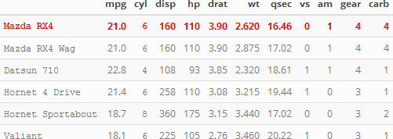

```{r setup, include=FALSE, warning=FALSE}
knitr::opts_chunk$set(echo = TRUE)
library(knitr)
library(pander)
library(kableExtra)
suppressPackageStartupMessages(library(tidyverse))
library(reticulate)
use_python("C:/Users/alumno-02/.conda/envs/mbdds_fc20_env")
panderOptions('table.split.table', Inf)
panderOptions('decimal.mark', ",")
panderOptions('big.mark', ".")
panderOptions('missing', "")
```

# Ejecuta Python

```{python, warning=FALSE}
import pandas as pd
import numpy as np
import matplotlib.pyplot as plt

df = pd.DataFrame({'X1':np.random.randn(100)})
df[['X1']].plot(kind='hist')

```

# plot R

```{r}
plot(density(rnorm(1000)))
```

# plot ggplot2

```{r}
ggplot(mtcars, aes(x = wt, y = mpg)) +
  geom_point()
```

test kable - html

```{r,echo =FALSE, results='hide',warning=FALSE}
kable(mtcars %>% head(), "html" , booktabs=TRUE ) %>%
  kable_styling(c("striped", "hover","condensed", "responsive")
                ,font_size = 12,full_width = F) %>%
  row_spec(1, color = "red",bold = TRUE)  %>%
  column_spec(c(1,3),monospace=TRUE) %>%
  save_kable("www/test.png")
```

{width=500px}


